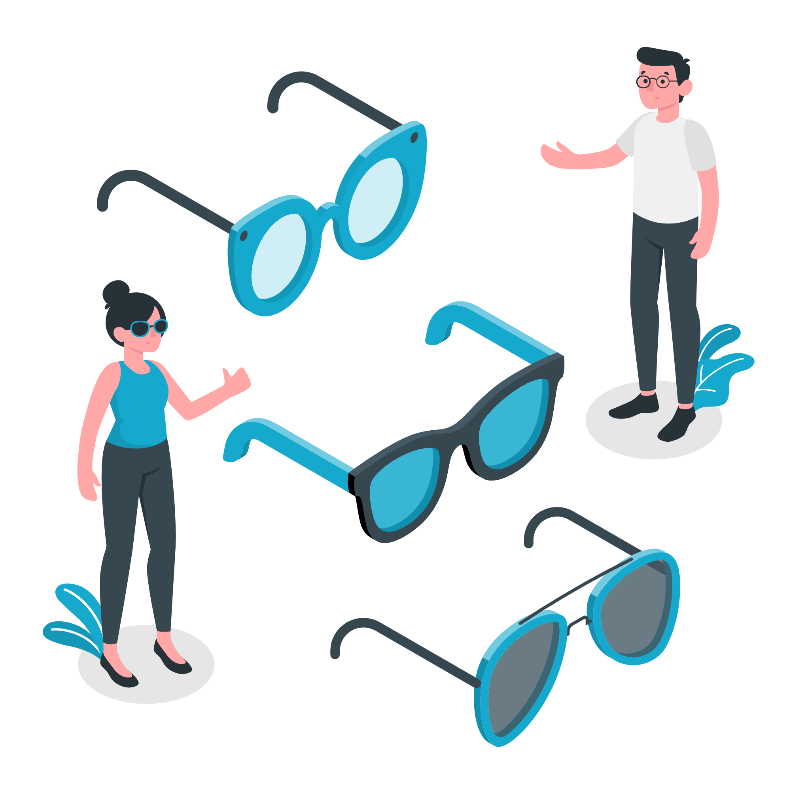

# ACME Sunglasses Shop


_Illustration by [Freepik Stories](https://stories.freepik.com/fashion)_


The ACME Sunglasses Shop is an eCommerce application that you can deploy to [Akka Serverless](https://cloudstate.com).

Currently, there are three services built to support the eCommerce site for ACME Sunglasses:

* [Orders](./orders): This service keeps track of the order history of users
* [Users](./users): This service keeps track of all users and has a collection of orderIDs to get order details from the orders service
* [Warehouse](./warehouse): This service keeps track of all the inventory

## Deploying the services

You have two ways to deploy the services, you can either use the ready-made images or you can build containers yourself.

### Deploy a set of ready-made images

To deploy the services, you'll need to have an [Akka Serverless account](https://docs.cloudstate.com/getting-started/lightbend-account.html). If you have one, you can deploy the services with the following commands:

```bash
## Deploy the users service and expose an HTTP endpoint
akkasls svc deploy acmesunglasses-users docker.io/retgits/acmesunglasses-users:1.0.0
akkasls svc expose acmesunglasses-users --enable-cors

## Deploy the orders service and expose an HTTP endpoint
akkasls svc deploy acmesunglasses-orders docker.io/retgits/acmesunglasses-orders:1.0.0
akkasls svc expose acmesunglasses-orders --enable-cors

## Deploy the warehouse service and expose an HTTP endpoint
akkasls svc deploy acmesunglasses-warehouse docker.io/retgits/acmesunglasses-warehouse:1.0.0
akkasls svc expose acmesunglasses-warehouse --enable-cors
```

### Build your own containers

To build and deploy your own containers, you'll need to have:

* an [Akka Serverless account](https://docs.cloudstate.com/getting-started/lightbend-account.html)
* Node.js v12 or higher installed
* the Docker CLI installed

If you have all of that ready, you can use `npm run-script` to build, push, and deploy your services:

```bash
## Set your dockerhub username
export DOCKER_USER=<your dockerhub username>

## Build, push, and deploy your services
BASE_DIR=`pwd`
for i in orders users warehouse; do
  cd $BASE_DIR/$i
  npm run-script dockerbuild
  npm run-script dockerpush
  npm run-script akkaslsdeploy
  npm run-script akkaslsexpose 
done
```

### Running images locally

There is an option to run a single service locally, to validate whether you've done the right things. To do so, you'll need to:

* Build your container
* Run both the container and Cloudstate proxy

```bash
docker run -d --name acmesunglasses-orders -p 8080:8080 <your dockerhub username>/acmesunglasses-orders:$npm_package_version
docker run -d --name proxy -p 9000:9000 --env USER_FUNCTION_HOST=<your local IP address> cloudstateio/cloudstate-proxy-dev-mode:latest
```

You can also do that using `npm run-script` commands

```bash
export CURRENT_IP=<your IP address>

cd <the service you want to test>

## start the containers
npm run-script akkaslslocalstart
```

This would output

```bash
> acme-sunglasses-orders@1.0.0 akkaslslocalstart
> docker run -d --name acmesunglasses-orders -p 8080:8080 ${DOCKER_USER:-retgits}/acmesunglasses-orders:$npm_package_version && docker run -d --name proxy -p 9000:9000 --env USER_FUNCTION_HOST=${CURRENT_IP:-host.docker.internal} cloudstateio/cloudstate-proxy-dev-mode:latest

9f6407d3e5fa057d5fb64fc40fd095a4f57f2bf465e08ef895a9391a6ab2294b
2f61b803e6b650e601a3c04104dc4f7abb3141da0aee06156c4e6d84a3075362
```

The first line is the container identifier of the orders function, the second line is the identifier of the Cloudstate proxy. You can get to the logs with `docker logs <container id>`.

To stop, you can run `npm run-script akkaslslocalstop`.

## Testing

What good are services if you can't test them? This section has a cURL command for each of the operations that the services expose.

### Warehouse

#### Receive Product

```bash
curl --request POST \
  --url https://<your Akka Serverless endpoint>/warehouse/5c61f497e5fdadefe84ff9b9 \
  --header 'Content-Type: application/json' \
  --data '{
    "id": "5c61f497e5fdadefe84ff9b9",
    "name": "Yoga Mat",
    "description": "Limited Edition Mat",
    "imageURL": "/static/images/yogamat_square.jpg",
    "price": 62.5,
    "stock": 5,
    "tags": [
        "mat"
    ]
}'
```

#### Get Product Details

```bash
curl --request GET \
  --url https://<your Akka Serverless endpoint>/warehouse/5c61f497e5fdadefe84ff9b9
```

#### Update Stock

```bash
curl --request POST \
  --url https://<your Akka Serverless endpoint>/warehouse/5c61f497e5fdadefe84ff9b9/stock \
  --header 'Content-Type: application/json' \
  --data '{
    "id": "5c61f497e5fdadefe84ff9b9",
    "stock": 10
}'
```

### Users

#### New User

```bash
curl --request POST \
  --url https://<your Akka Serverless endpoint>/user/1 \
  --header 'Content-Type: application/json' \
  --data '{
	"id": "1",
	"name": "retgits",
	"emailAddress": "retgits@example.com",
	"orderID":[]
}'
```

#### Get User Details

```bash
curl --request GET \
  --url https://<your Akka Serverless endpoint>/user/1
```

#### Update User Orders

```bash
curl --request POST \
  --url https://<your Akka Serverless endpoint>/user/1/order \
  --header 'Content-Type: application/json' \
  --data '{
	"id": "1",
	"orderID": "1234"
}'
```

### Order

#### Add Order

```bash
curl --request POST \
  --url https://<your Akka Serverless endpoint>/order/1 \
  --header 'Content-Type: application/json' \
  --data '{
	"userID": "1", 
	"orderID": "4557", 
	"items":[
		{
			"productID": "turkey", 
		 	"quantity": 12, 
			"price": 10.4
		}
	]
}'
```

#### Get Order Details

```bash
curl --request GET \
  --url https://<your Akka Serverless endpoint>/order/1 \
  --header 'Content-Type: application/json' \
  --data '{
	"userID": "1",
	"orderID": "1234"
}'
```

#### Get All Orders

```bash
curl --request GET \
  --url https://<your Akka Serverless endpoint>/order/1/all
```

## License

See the [LICENSE](./LICENSE) file in the repository
